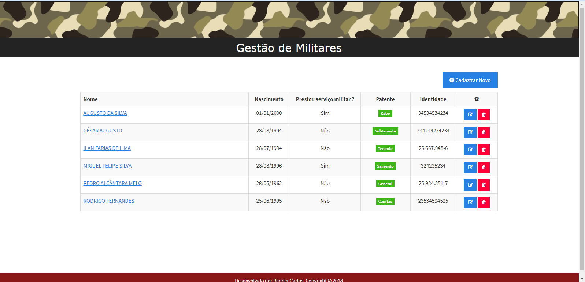

# Sistema de Cadastro de Militares
> Simples CRUD de militares. Desafio para a vaga de Desenvolvedor PHP na CTIS.


Sistema para gerenciamento de militares. Permite visualizar, cadastrar, alterar e excluir militares.
Trabalha com os seguintes dados: nome, identidade(RG), data de nascimento, serviço militar obrigatório, patente



O sistema está acessível no endereço: [https://desafio-ctis-militares.herokuapp.com/](https://desafio-ctis-militares.herokuapp.com/)


## Pré-requisitos


- PHP 7.1
- Servidor Apache ou Nginx(ambos são opcionais para ambiente de desenvolvimento)
- Laravel 5.4 
- MySQL v5.*
- Browser atual


## Instalação e execução


**Windows, OS X & Linux:**

Baixe o arquivo zip e o descompacte ou baixe o projeto para sua máquina através do git clone [https://github.com/randercarlos/militares-laravel.git](https://github.com/randercarlos/militares-laravel.git)


- Crie o banco de dados do projeto no MySQL


- Entre no prompt de comando e vá até a pasta do projeto: 


```sh
cd ir-ate-a-pasta-do-projeto
```


- Crie o arquivo .env através do arquivo .env.example:


```sh
cp .env.example .env
```


- Configure as variáves setadas dentro do arquivo .env:


> **OBS:** A variável **APP_URL** deve receber a URL do projeto.

> **OBS2:** As variáveis **DB_CONNECTION**, **DB_HOST**, **DB_PORT**, **DB_DATABASE**, **DB_USERNAME**,
**DB_USERNAME**, **DB_PASSWORD** devem ser setadas com as configurações do banco.


- Com as variáveis de ambiente configuradas, vá ao terminal e dentro da pasta raiz do projeto, execute o comando:

```sh
php artisan serve
```

- Se tudo der certo, o artisan exibirá uma mensagem que o projeto estará rodando no [http://localhost:8000](http://localhost:8000).


- Abra um navegador atual qualquer e execute o http://localhost:8000 para ver o projeto funcionando...


## Autor

Rander Carlos – randerccf@gmail.com
